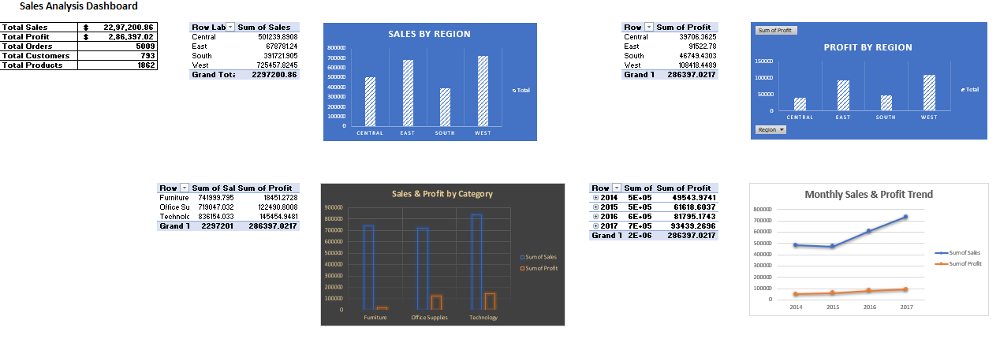
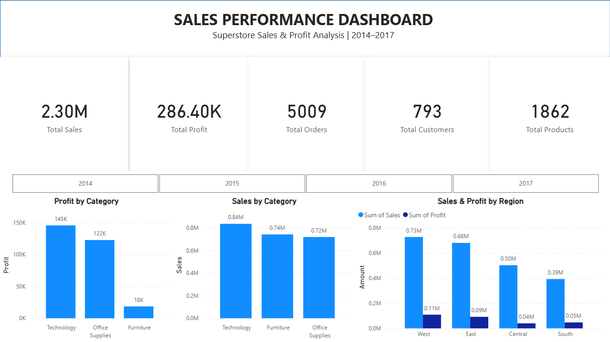

# Sales Analysis Project

## Project Overview

This project analyzes the Sample Superstore dataset to understand sales, profit, customers, products, regions, categories, shipping performance, and discount patterns.

The project was developed using Python and includes data cleaning, exploratory data analysis, business analysis, and data visualization.

## Objectives

- Analyze overall sales and profit performance
- Identify high-performing regions and categories
- Analyze customer and product performance
- Understand sales and profit trends over time
- Analyze shipping modes and shipping time
- Examine the relationship between discounts and profit
- Generate business insights from the data

## Tools and Technologies

- Python
- Pandas
- NumPy
- Matplotlib
- Excel
- Power BI
- Git and GitHub

## Project Structure

Sales-Analysis/
|
+-- charts/
|   +-- Generated analysis charts
|
+-- dataset/
|   +-- Sample - Superstore.xlsx
|
+-- excel/
|   +-- Excel analysis and dashboard
|
+-- powerbi/
|   +-- Power BI dashboard
|
+-- python/
|   +-- analysis.py
|
+-- reports/
|   +-- clean_superstore_data.csv
|   +-- correlation_matrix.csv
|   +-- kpi_summary.csv
|   +-- sales_analysis_report.xlsx
|
+-- README.md
+-- requirements.txt
+-- .gitignore

## Key KPIs

| KPI | Value |
|---|---:|
| Total Sales | $2,297,200.86 |
| Total Profit | $286,397.02 |
| Total Orders | 5,009 |
| Total Customers | 793 |
| Total Products | 1,862 |

## Key Insights

- The West region generated the highest sales and profit.
- Technology was the highest-performing category for both sales and profit.
- The analysis identifies the top customers, products, states, cities, and sub-categories based on sales and profit.
- Monthly sales and profit trends were analyzed to understand performance over time.
- Shipping modes were compared based on sales, profit, order volume, and average shipping time.
- Discount levels were analyzed in relation to sales and profit.

## Analysis Performed

### Sales and Profit Analysis

- Sales by Region
- Profit by Region
- Sales by Category
- Profit by Category
- Sales by Segment
- Profit by Segment

### Customer and Product Analysis

- Top 10 Customers by Sales
- Top 10 Customers by Profit
- Top 10 Products by Sales
- Top 10 Products by Profit
- Top 10 Products by Quantity
- Top 10 Sub-Categories by Sales
- Top 10 Sub-Categories by Profit

### Geographic Analysis

- Top 10 States by Sales
- Top 10 States by Profit
- Top 10 Cities by Sales
- Top 10 Cities by Profit

### Shipping Analysis

- Sales by Ship Mode
- Profit by Ship Mode
- Orders by Ship Mode
- Average Shipping Time

### Discount Analysis

- Average Discount by Category
- Discount vs Sales
- Discount vs Profit

### Statistical Analysis

- Correlation Matrix
- Correlation Heatmap
- Sales vs Profit

## Dataset

The project uses the Sample Superstore dataset containing information about orders, customers, products, sales, profit, discounts, shipping, categories, and geographic regions.

## Key Performance Indicators

| KPI | Value |
|---|---:|
| Total Sales | $2,297,200.86 |
| Total Profit | $286,397.02 |
| Total Orders | 5,009 |
| Total Customers | 793 |
| Total Products | 1,862 |

## Key Insights

- **West** was the highest-performing region by sales, generating **$725,457.82**.
- **Technology** was the top category by sales, generating **$836,154.03**.
- **Technology** also generated the highest profit at **$145,454.95**.
- Customer, product, regional, category, shipping, and discount patterns were analyzed to identify business performance trends.

  ## Project Structure

text
Sales-Analysis/
├── charts/       # Python-generated visualizations
├── dataset/      # Source dataset
├── excel/        # Excel dashboard
├── powerbi/      # Power BI dashboard
├── python/       # Python analysis scripts
├── reports/      # Analysis reports and summary files
├── README.md
├── requirements.txt
└── .gitignore

## Dashboards

### Excel Dashboard
The Excel dashboard provides KPI summaries and interactive analysis of sales, profit, region, category, and monthly performance.

### Excel Dashboard
The Excel dashboard provides KPI summaries and interactive analysis of sales, profit, region, category, and monthly performance.

### Power BI Dashboard
The Power BI dashboard provides an interactive view of key sales and profit KPIs, category performance, regional performance, and year-based filtering.

Dashboard files are available in the `excel/` and `powerbi/` folders.

### Power BI Dashboard
The Power BI dashboard provides an interactive view of key sales and profit KPIs, category performance, regional performance, and year-based filtering.

## Analysis Workflow

1. Data loading and validation
2. Data cleaning and preprocessing
3. Exploratory data analysis
4. KPI calculation
5. Sales and profit analysis
6. Customer and product analysis
7. Regional and category analysis
8. Shipping and discount analysis
9. Data visualization
10. Dashboard development using Excel and Power BI

## Tools & Technologies

- **Python:** Pandas, Matplotlib
- **Excel:** PivotTables, PivotCharts, formulas
- **Power BI:** DAX, interactive dashboards
- **Git & GitHub:** Version control and project sharing

## Author

Deena
